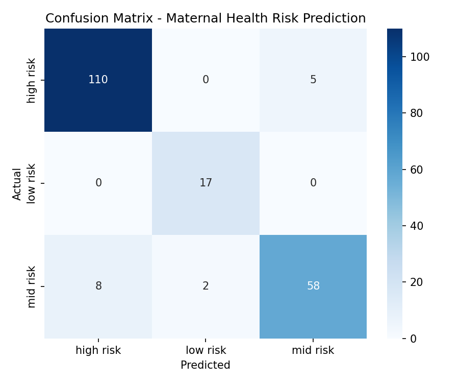
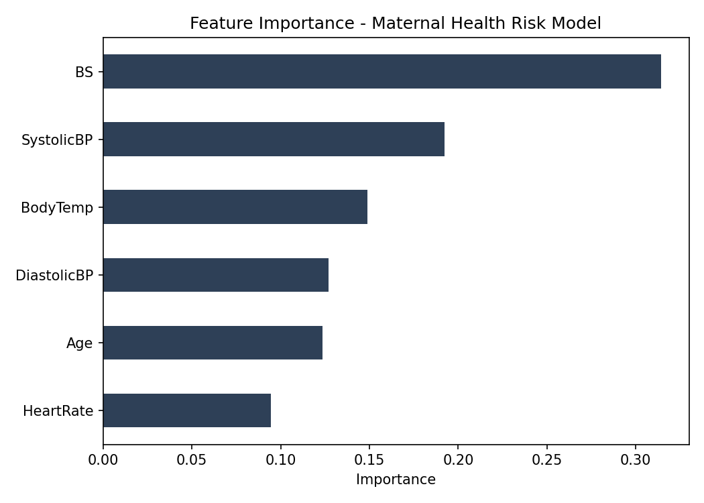

# Maternal Health Risk Prediction Model

## Overview
A machine learning classifier that predicts maternal pregnancy risk level (low, mid, high)
from routine antenatal clinical indicators — age, blood pressure, blood sugar, body
temperature, and heart rate. Built as part of my independent preparation for the Master
of Health Data Analytics, this project explores how vital signs collected at a standard
antenatal visit could be used to flag at-risk pregnancies earlier, particularly in
resource-constrained community health settings where specialist screening is not always
available.

## Motivation
This project sits directly upstream of my intended Master's research, which focuses on
predicting maternal and neonatal risk using routine data from South African community
health centres. Before working with real facility or PPIP data, I wanted to build and
test the core modelling approach — feature selection, classification, and evaluation —
on a clean, well-understood dataset structured the same way routine antenatal data is
typically captured.

## Dataset
Structured to match the well-known UCI/Kaggle Maternal Health Risk dataset schema:
- Age
- Systolic blood pressure
- Diastolic blood pressure
- Blood sugar (BS)
- Body temperature
- Heart rate
- Risk level (low / mid / high) — target variable

*Note: this version uses a synthetically generated dataset built to reflect realistic
clinical relationships (e.g. elevated blood sugar and systolic BP driving higher risk
classification, consistent with gestational diabetes and preeclampsia risk patterns).
The same pipeline is designed to run unchanged on the real UCI dataset or on routine
facility data.*

## Method
- **Model:** Random Forest Classifier (200 estimators, balanced class weights to handle
  the natural imbalance toward high-risk cases)
- **Split:** 80/20 train-test, stratified by risk level
- **Evaluation:** Accuracy, precision, recall, F1-score, confusion matrix

## Results
- **Accuracy:** 92.5%
- **High risk recall:** 96% — the model rarely misses a genuinely high-risk case, which
  matters most clinically, since a false negative here is more dangerous than a false
  positive
- **Top predictive features:** Blood sugar (31%), Systolic BP (19%), Body temperature
  (15%) — consistent with known clinical risk factors for gestational diabetes and
  hypertensive disorders of pregnancy

## Reflection
What stood out to me most was how strongly blood sugar and systolic blood pressure
dominated the model's decisions — both are measurements already taken at every antenatal
visit in South African community health centres, which means a tool like this would not
require new equipment or new data collection, only better use of what is already being
recorded. That is exactly the kind of "low-cost, high-impact" intervention I want my
Master's research to build toward.

The next step for this project, once I have access to real facility-level or PPIP data,
is to test whether the same modelling approach holds up on real South African community
health data, and to extend it to include postnatal follow-up status as an additional
outcome — connecting prenatal risk prediction directly to the loss-to-follow-up question
at the centre of my intended thesis.

## Tech Stack
Python, Pandas, Scikit-learn, Matplotlib, Seaborn

## Files
- `generate_data.py` — synthetic dataset generation
- `model.py` — model training, evaluation, and visualisation
- `maternal_risk.csv` — dataset
- `confusion_matrix.png`, `feature_importance.png` — output visualisations
